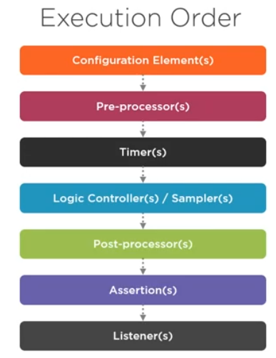

# Jmeter Performance Testing Tool

## Performance Testing
- Test how an application or resource performs under a given load to see its impact.
- Performance test is done after functional testing.
- Performance testing is all about testing in terms of 
  - Response Time
  - Scalability
  - Reliability - no of errs/no of requests
  - Throughput - number of transactions/ unit of time
- Perfomance testing process
  - Design and build tests
  - Prepare test env
  - Run the tests
  - Analyze the results
  - Optimize
  - Retest
  
  > Two Ways to generate Load
  > - no of users
  > - no of requests
- Types of Performance Tests
  
  - Smoke Test - just to check application
  - Load Test - test with specific load level
  - Stress Test - Test with loads beyond its maximum capacity
  - Spike Test - varied load
  - Endurance Test - Same specific load for a long time to check application memory leak, long run effects ..etc.
- ## Jmeter
  - Jmeter works at protocol level
  - Running jmeter in cmd mode
    - ``` jmeter -n -t test.jmx -l result.csv -j logfile.log -e -o outputfolder```
    > -n -> non graphical mode
    > -t -> specify file
    > -j -> log file path
    > -e -> to generate report
    > -o -> specify outputFolder
  - To install plugin to jmeter just copy the plugin jar to /lib/ext folder of jmeter
- ## Creating a sample test
  - Test Plan - The root element of a test, where its overall settings are specified and all the other elements are contained
  - Thread Groups - Entry point of test - controls the no of threads Jmeter will use to execute your test.
  - Configuration Elements - Used to setup default configurations and variables for later use
    - config elements rules
      - the userdefined variables config is processed first at the start of a test no matter where it is placed
      - A configuration element inside a tree branch has higher precedence than another element of a same type in a outer branch
  - controllers and samplers - controllers are childrens of thread group
    - Login controllers - lets you customize the logic to decide when to send requests
    - samplers - performs a request , generating one or more results
  - Timers - Introduces a delay between request
    - timers are always executed in conjunction with samplers if no sampler the timer dont run
    - If we have more than 1 timer then the sum of timers are taken as delay for running a sampler
  - Assertions - Validate a response 
    - they can be added at rthread group leve/ contriller level/ sampler level
  - Listners - Listen to responses and aggregating metrics
    - It aggregates info on only those request at or below its level
- 
  - pre processor and post processors
- Recording controller

> Note: Use https://try.jsoup.org/ for css extractor 
- Test fragments 
  - Hold other elements inside for the purpose of reusing
  - Controllers that reference test fragments
    - Module controller - references test fragments in the same test plan
    - Include Cotroller -references test fragments in external Jmeter files


> Note application performance is measured in terms of 3 metrix
>   - Response Time
>   - Throughput
>   - Error Rate
> Important Server performance metrix
>   - CPU
>   - Memory
>   - Network bandwidth
> Note: - perfMon plugin is used to monitor server side metrix
> ``` jmeter -n -t LearnTestPlan.jmx -l result.csv -e -o output ```